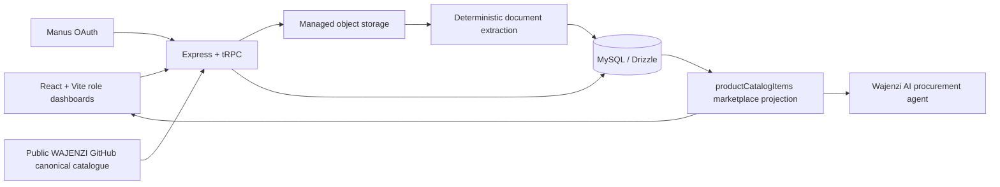
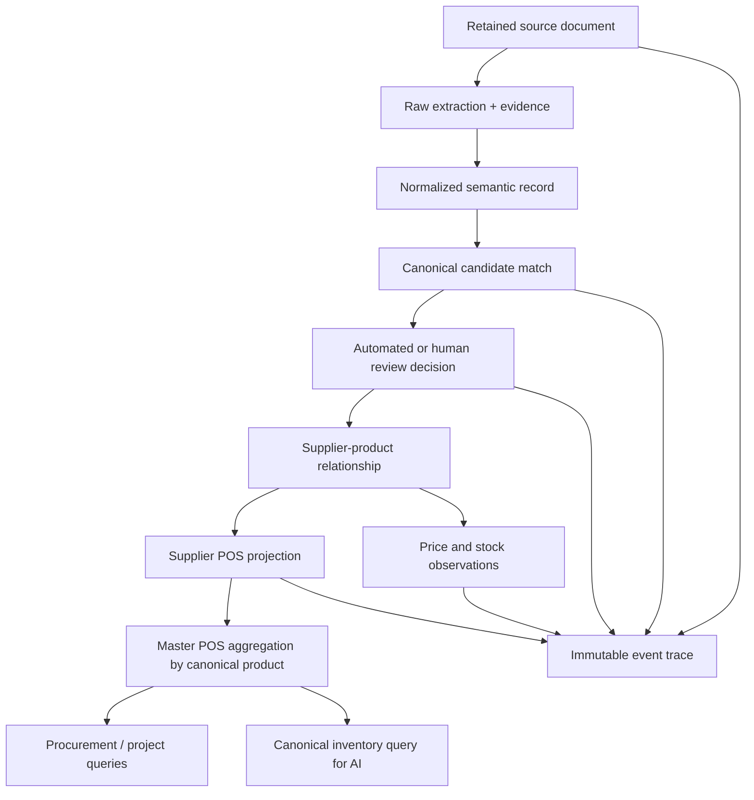

# Wajenzi.AI supplier document → POS architecture audit

## Executive conclusion

The platform already contains the correct **foundations to extend rather than replace**: a React/Vite role-aware frontend, Express/tRPC backend, managed MySQL persistence, Manus OAuth, object storage, a deterministic semantic extraction pipeline, a supplier/manufacturer review interface, an active marketplace projection, and a server-side read-only canonical catalogue integration. The external WAJENZI repository states that supplier submissions must attach to existing canonical products where evidence supports a match and must not create canonical products directly.[1]

The next implementation must therefore introduce controlled registry matching, supplier-product relationships, POS projections, observation history, document lineage, decision records, and events around those foundations. It must **not** create another master catalogue, alternate ontology, parallel supplier catalog, or disconnected point-of-sale database.

## Current architecture map

| Concern | Existing foundation | Reuse decision |
| --- | --- | --- |
| Frontend | React 19, Vite, TypeScript, Tailwind, role-aware `DashboardLayout`, Supplier and Manufacturer semantic-extraction panels | Reuse the existing dark dashboard and place review, canonical match, supplier POS, and Master POS views within it. |
| Backend | Express 4 and typed tRPC procedures in `server/routers.ts` | Reuse typed procedures; add product matching, review, POS projection, history, and event procedures instead of separate REST services. |
| Authentication | Manus OAuth with `protectedProcedure`; source and result queries are owner-scoped | Reuse as the immediate privacy boundary; evolve to organization membership enforcement before multi-user supplier deployment. |
| File storage | Authenticated raw-binary intake and managed object storage keys | Reuse; retain source bytes outside MySQL and retain source metadata/checksums in MySQL. |
| Extraction | PDF, DOCX, TXT, CSV, XLSX, and XLS parsing; raw text, source-row evidence, normalized records, KES/unit normalization, readiness | Reuse and extend. Image/scanned-document OCR is a later capability; current image-only files remain reviewable failures. |
| Canonical source | Server reads the public WAJENZI master canonical catalogue from GitHub with a five-minute cache | Reuse as source authority. The upstream registry describes the master catalogue as identity authority and requires supplier submissions to enter through the controlled submission-to-candidate-to-decision flow.[2] |
| Marketplace / supplier POS | `productCatalogItems` is the current supplier-facing commercial projection. It is updated only from ready reviewed semantic records. | Treat it as an initial **Supplier POS projection**, not a second master data store. Create linked supplier-product and observation records as the authoritative commercial relationship. |
| Master POS | Public marketplace query aggregates active catalog items only; it does not currently aggregate offers by canonical product | Add a canonical-product aggregation query/projection without exposing private commercial values beyond permitted views. |
| Events and audit | Generic workflow actions and role work items exist; semantic records retain source evidence | Extend with immutable, correlated business events for document, matching, review, price, stock, POS, and Master POS transitions. |
| Background jobs | No durable queue or asynchronous processing job exists; extraction runs when explicitly invoked | Add a persisted job state machine triggered by upload. Keep processing request-safe and idempotent; only introduce scheduled recovery when a concrete retry policy needs it. |
| AI | Procurement agent currently relies on user-provided context plus marketplace discovery | Extend it with a typed canonical inventory query. It must resolve canonical IDs and supplier offer records before presenting commercial inventory. |
| Validation and deployment | Vitest, TypeScript checks, production build, managed Autoscale deployment, checkpoint publishing | Reuse and expand test coverage to canonical matching, idempotency, tenant isolation, history, review, and projection behavior. |

## Existing data flow and required extension

The existing flow is **Supplier/Manufacturer source upload → secure storage → extracted raw text → normalized semantic record → readiness review → controlled marketplace item**. It already retains raw supplier values separately from normalized values and keeps needs-review records out of the public marketplace.

The supplied specification requires the following governed extension:

## Canonical registry boundary

The canonical source is **not** a supplier listing feed. The upstream contract makes three decisions that guide this implementation: supplier SKU is an external identifier rather than a global canonical ID; commercial price/stock belong to supplier offers/observations rather than canonical product identity; and fuzzy similarity is candidate discovery only, not automatic canonical merge.[2]

| Existing value | Target responsibility | Migration rule |
| --- | --- | --- |
| GitHub `canonical_entity_id` | Canonical registry identifier in a local reference cache | Preserve unchanged; never derive a different canonical ID from a supplier title or SKU. |
| `semanticProductRecords.supplierProductName` | Supplier-source evidence | Preserve unchanged. |
| `semanticProductRecords.normalizedProductName` | Matching input and reviewed supplier-product label | Preserve as normalized value; never overwrite canonical identity. |
| `productCatalogItems` | Supplier POS / marketplace projection | Generate or update from an approved supplier-product relationship, price observation, and availability observation. |
| `priceKes` and `stockQuantity` | Current commercial state | Convert to append-only observations and project latest approved values. |
| Generic workflow events | Existing activity context | Retain; add canonical event rows for governed pipeline decisions. |

## Reuse, extension, and deferred decisions

| Category | Decision |
| --- | --- |
| Reuse immediately | Semantic document intake, parsing, evidence retention, current role dashboards, canonical GitHub reader, marketplace projection, Manus OAuth, managed storage, tRPC, and current test harness. |
| Extend immediately | Local canonical reference cache/match result, supplier-product relationship, price and stock observations, review decision, document lineage/checksum idempotency, processing jobs, events, Supplier POS and Master POS queries. |
| Preserve as controlled future work | Canonical creation for unmatched submissions. The upstream registry permits it only through explicit stewardship, so this implementation will create a candidate/review state—not new canonical IDs automatically.[2] |
| Defer until a validated operational requirement | Image and scan OCR, external supplier ERP/POS synchronisation, full organization-role enforcement, continuous queue workers, embedding/vector search, and direct finance/payment transactions. |

## Specification decision map

| Supplied requirement | Current Wajenzi.AI component | Controlled decision |
| --- | --- | --- |
| Canonical master product authority | `githubCanonicalCatalogue.ts` reads the published GitHub master catalogue | Build a local read-through registry reference and persist candidate match decisions. Never treat a supplier SKU, supplier title, price, or stock value as canonical identity. |
| Supplier product relationship | `semanticProductRecords` and `productCatalogItems` carry source and commercial fields | Add a dedicated supplier-product relationship to bind an approved supplier submission to exactly one canonical product or variant while retaining the raw supplier values. |
| Supplier POS | Existing active `productCatalogItems` projection | Preserve as the outward-facing supplier POS projection, but derive it from approved supplier products plus latest price/stock observations. |
| Master POS | Existing public marketplace list | Add an aggregated canonical-product query that groups permitted supplier offers; avoid creating a duplicate inventory master table. |
| Human review | Existing semantic readiness and publisher confirmation | Add match review decisions and candidate states. A low-confidence match cannot publish or create a canonical identity. |
| Price and stock history | Current fields are current-state only | Append observations when an approved supplier-product commercial value changes, then project the latest approved observation into Supplier POS. |
| Document versions and duplicate uploads | Stored SHA-256 checksum without lineage behavior | Use supplier/workspace/checksum to return the retained document for an exact duplicate. Use a stable supplier-source key and lineage link for revisions. |
| Asynchronous processing | Upload succeeds and user triggers extraction through a mutation | Persist a processing job and correlation ID at intake. The first deployment slice will process when requested and retain retryable state, rather than relying on an in-memory timer. |
| Audit event envelope | Workflow action and role-work item tables | Add immutable domain events with entity reference, actor, correlation ID, prior state, next state, and document/source link. |
| Agent and procurement queries | Existing marketplace query and AI procurement agent | Add typed canonical inventory lookup procedures. The agent will receive resolved canonical records/offers, not authoritative product names produced only by a language model. |
| Private commercial data | Owner-scoped semantic source/results; public active catalog projection | Maintain owner scope on source, match, supplier product, observations, and private POS controls. Return public offers only from reviewed, active projections. |

## Architecture constraints

The object-storage file remains the byte-level source of truth. MySQL stores only metadata, checksums, extracted text, structured relationships, controlled fields, decisions, and evidence references. Private supplier commercial values remain owner/organization scoped; only the public marketplace projection exposes approved, currently active product offers. The Master POS must aggregate offers by canonical product but not rewrite canonical identity.

To remain deployable on the current managed hosting, processing will use persisted job states and event-triggered retries rather than unreliable in-process timers. Long-running OCR or ingestion workloads that exceed the current managed runtime must be evaluated separately before introducing a persistent worker.

## Proposed normalized entity model

| Entity | Primary purpose | Identity and key constraints | Relationship / projection rule |
| --- | --- | --- | --- |
| `canonicalProductRegistry` | Local read-through registry projection of GitHub canonical roots | `canonicalEntityId` is the existing immutable upstream ID and is unique; `sourceRowId` is retained as source evidence | Never receives supplier price, stock, SKU, or title as a canonical overwrite. |
| `canonicalProductMatches` | One reviewable match outcome per semantic product record | Unique `semanticProductId`; nullable canonical target supports unmatched candidates | Holds method, score, reason, evidence, status, and reviewer decision. |
| `supplierProducts` | The approved supplier-to-canonical relationship | Unique `(ownerUserId, semanticProductId)` prevents an extracted row from creating duplicate supplier products | Commercial projection is derived from this relationship and latest observations. |
| `supplierPriceObservations` | Append-only approved price facts | Indexed by supplier product and observed timestamp | Current POS price is latest observation; history is never overwritten. |
| `supplierStockObservations` | Append-only approved availability facts | Indexed by supplier product and observed timestamp | Current POS stock is latest observation; history is never overwritten. |
| `documentProcessingJobs` | Retryable processing state and correlation context | One current job per source and correlation ID | Supports upload, extraction, matching, review, and projection lifecycle reporting without relying on memory. |
| `supplierDocumentLineage` | Explicit document version relationship | Source document child points to optional predecessor plus version number | Exact checksum duplicates resolve to existing source; a revised document can retain lineage without duplicating supplier products. |
| `supplierProductEvents` | Immutable audit envelope | Each event stores actor, entity, correlation ID, source document, previous state, and next state | Captures document, match, review, price, stock, supplier POS, and Master POS transitions. |

The existing `productCatalogItems` remains the **Supplier POS projection** and existing public marketplace read path remains its approved-discovery surface. The Master POS is implemented as a typed aggregation over canonical registry entries, approved supplier-product relationships, and latest permitted observations, not a new mutable master product table.

## References

[1]: https://github.com/Wajenzi-ai/wajenzi-ai "Wajenzi-ai/wajenzi-ai repository"
[2]: https://raw.githubusercontent.com/Wajenzi-ai/wajenzi-ai/main/ontology-registry/docs/canonical-product-import.md "WAJENZI Master Canonical Product and Supplier Ingestion Contract"
